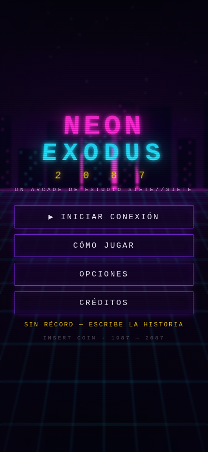
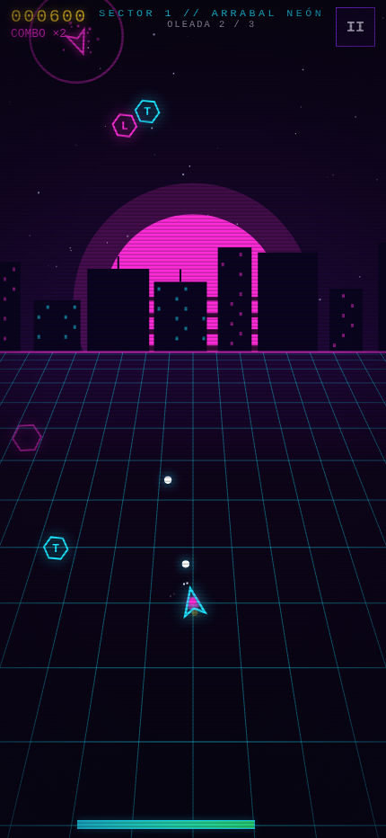
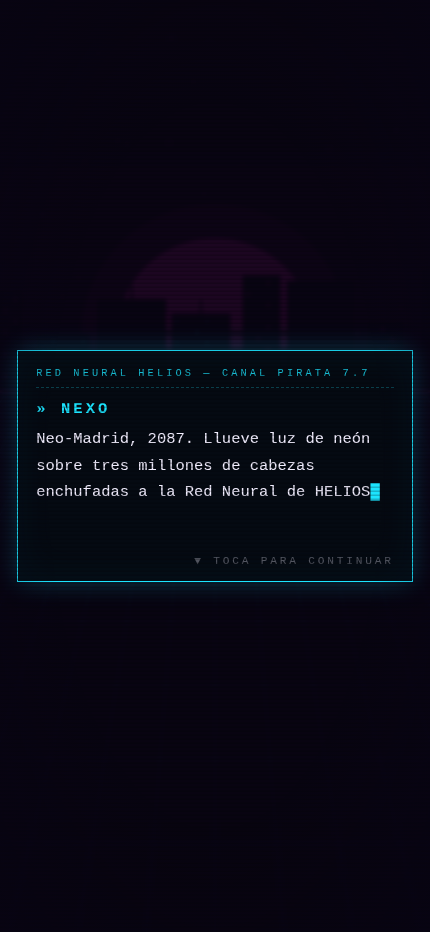
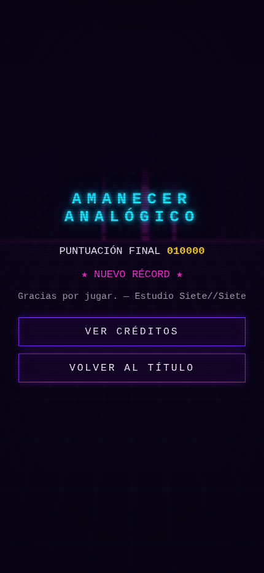

# NEON EXODUS 2087 🌆

> Neo-Madrid, 2087. Llueve luz de neón sobre tres millones de cabezas enchufadas
> a la Red Neural de HELIOS. Esta noche, una runner va a despertarlas a todas.

Arcade de acción **synthwave ochentero** (twin-stick shooter) creado en una sola
noche por **Estudio Siete//Siete**: 5 sectores, 8 tipos de enemigo, jefe final de
3 fases, banda sonora sintetizada en tiempo real y una historia completa en
castellano. Sin dependencias, sin instalación: HTML5 puro.

| Título | Combate | Historia | Final |
|---|---|---|---|
|  |  |  |  |

## 🎮 Cómo jugar en tu iPhone

**Opción A — URL directa (recomendada).** Ya está desplegado en GitHub Pages.
Abre en Safari:

```
https://ruben-arconada.github.io/neon-exodus-2087/
```

Consejo: en Safari toca **Compartir → Añadir a pantalla de inicio** y se
ejecutará a pantalla completa, como una app nativa. Juega con sonido. 🎧

**Opción B — un solo archivo.** [`neon-exodus-2087.html`](neon-exodus-2087.html)
contiene el juego completo (104 KB, sin conexión): descárgalo y ábrelo con
doble clic en cualquier navegador de escritorio.

**Opción C — local.** Clona el repo y sirve la carpeta con cualquier estático
(`npx http-server`, `python3 -m http.server`…). También funciona abriendo
`index.html` a pelo.

## 🕹️ Controles

| Acción | iPhone | Escritorio |
|---|---|---|
| Mover | pulgar izquierdo (stick flotante) | WASD / flechas |
| Apuntar y disparar | pulgar derecho (opcional: hay autoapuntado) | ratón (disparo automático) |
| Dash (invulnerable) | doble toque en la mitad izquierda | ESPACIO o doble clic |
| Pausa | botón ⏸ | ESC / P |

Encadena bajas sin recibir daño para subir el **combo hasta ×8**. Recoge los
hexágonos: **T**riple, **R**ápido, **E**scudo, **B**omba, tiempo-ba**L**a y **+**vida.

## 🏗️ El estudio (7 perfiles, una noche de crunch)

| Rol | Nombre | Documento |
|---|---|---|
| Dirección de juego | Marlowe Díez | [docs/gdd.md](docs/gdd.md) |
| Dirección de arte | Iria Cromo | [docs/biblia-arte.md](docs/biblia-arte.md) |
| Programación gameplay senior | Bruno «Bit» Salcedo | [docs/tecnico.md](docs/tecnico.md) |
| Audio y banda sonora | Sofía Láser | [docs/audio.md](docs/audio.md) |
| Guion y narrativa | Andrés Voltio | [docs/narrativa.md](docs/narrativa.md) |
| Diseño UX/UI | Kai Mendoza | [docs/ux.md](docs/ux.md) |
| QA y producción | Rita Píxel | [docs/qa-informe.md](docs/qa-informe.md) |

*Siete perfiles, una sola mente sintética.* Todo el juego —código, arte
procedural, música y guion— se generó sin assets externos.

## 🔧 Tecnología

- **Canvas 2D** con pools de objetos, partículas aditivas y fondo synthwave procedural (sol de franjas, skyline con semilla por sector, rejilla en perspectiva).
- **Web Audio**: 8 temas musicales y todos los efectos sintetizados con osciladores y ruido. Ni un sample.
- **iOS first**: safe areas del Dynamic Island, sticks táctiles flotantes, autopausa, modo pantalla completa al añadir a inicio.
- Récords y opciones en `localStorage`. 61 fps medidos en viewport de iPhone 14 Pro Max.

— *Estudio Siete//Siete · Neo-Madrid, 2087 / Tierra, 2026*
